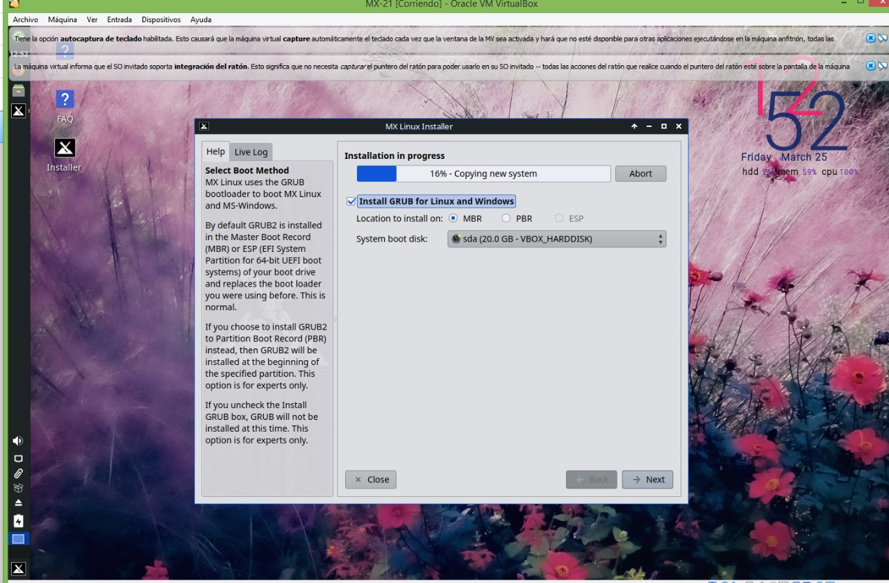
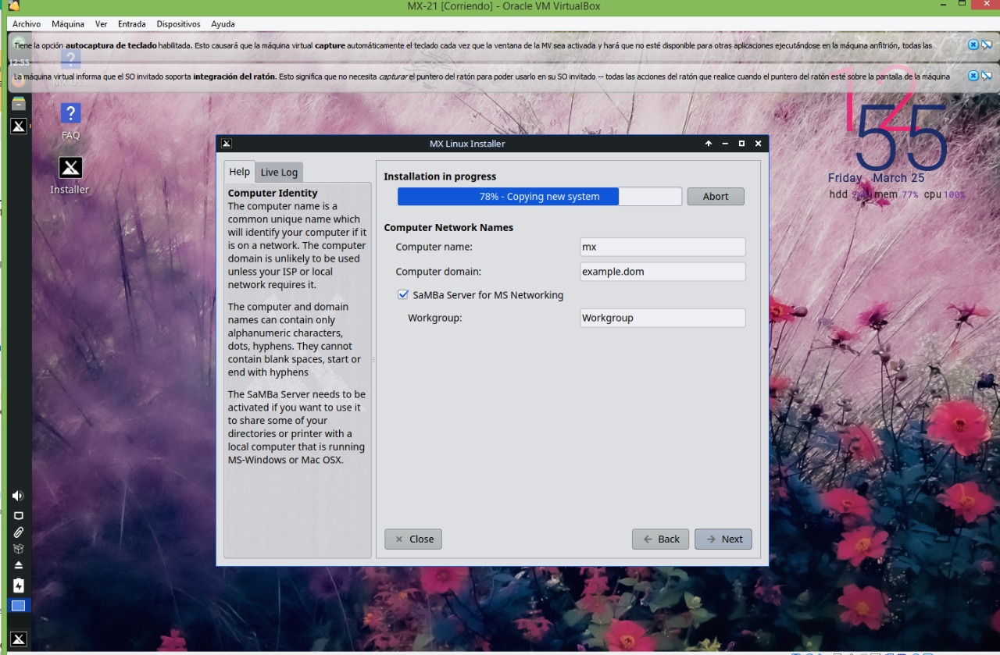
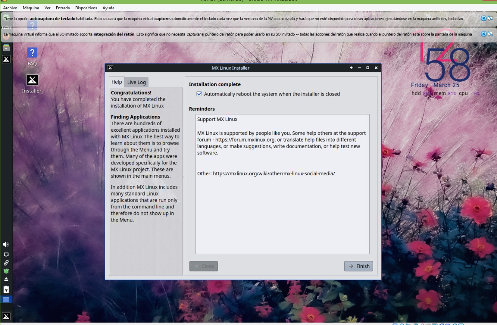
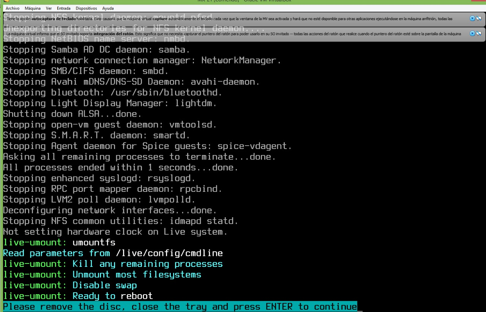
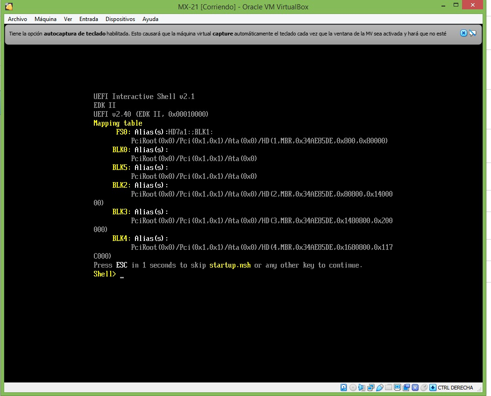
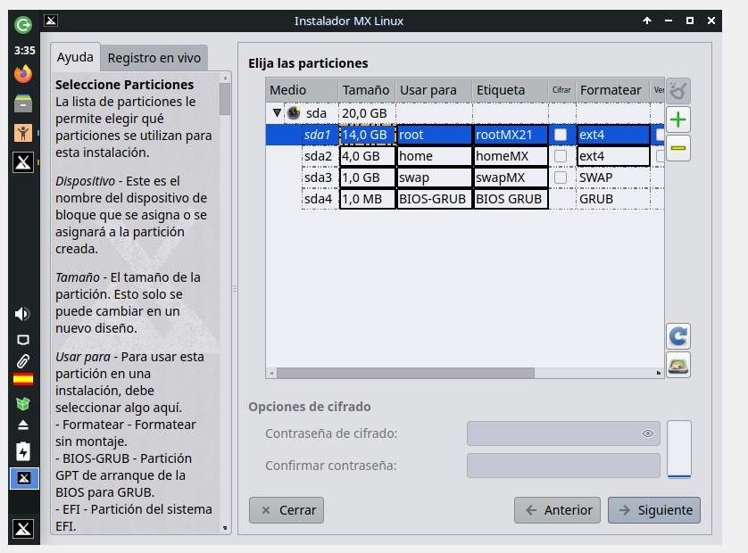
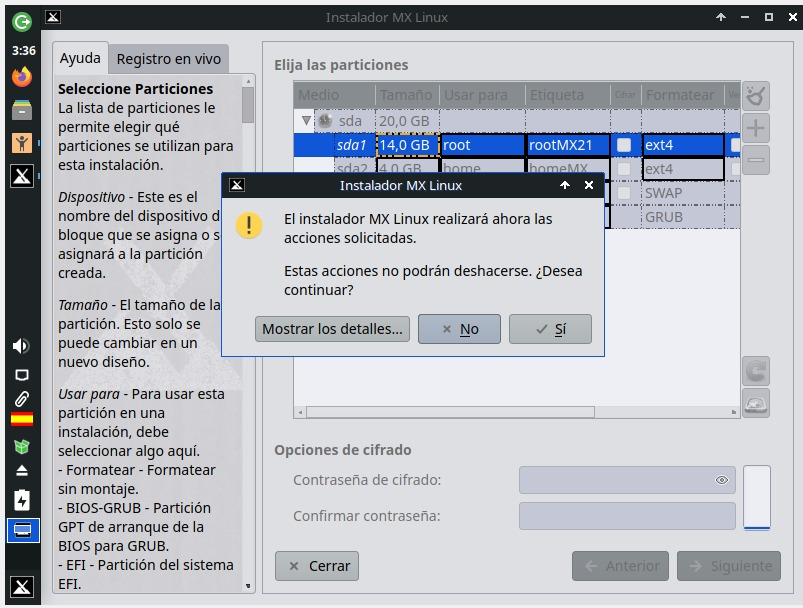
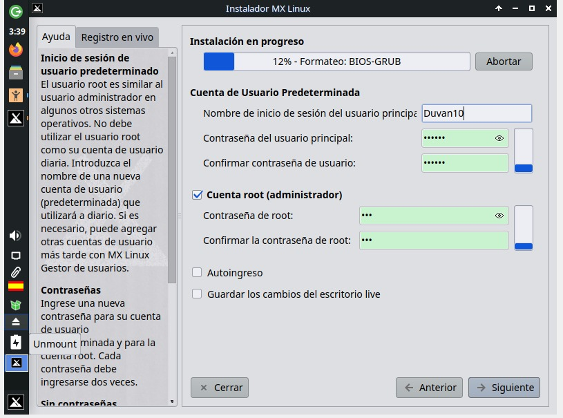
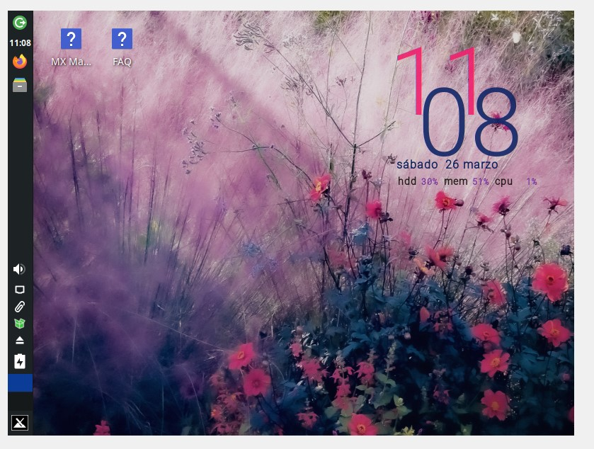

# MX-21
instalacion de sistema operativo MX-21

integrantes:
Juan Felipe Merchancano
Diana Leonela Atehortua Caicedo
Duvan Aguirre

hecho para el Docente :
Giancarlos 

Paso 1:
Al momento de instalar MX-21 lo primero se debe instalar la imagen iso  de MX Linux.

Luego de que se haya descargado,se debe asegurar que la bios este configurada.

PASO 2: instalación de Mx-linux
Al momento de arrancar el sistema, hay que seleccionar la primera que tiene el nombre de la maquina MX-21 x64,luego damos click en la opción que dice instalar MX-linux

PASO 3: configuración de teclado
Se debe seleccionar opción de teclado apropiado deacuerdo a la preferencia del usuario

PASO 4: Particion del disco
Para la partición hay formas de instalar.se puede instalar atraves de modo habitual o automáticamente, o se puede  personalizar manualmente las particiones de este, pudiendo le dar el tamaño correspondiente a las preferencias del usuario para cada, directorio que manejara la maquina virtual

Además emerge una sale una alerta en la que pregunta si se quiere guardar los cambios.

A continuación se descargaran todos los paquete indispensables  para  la instalación y funcionamiento .
La barra indica el progreso de la instalación de la información requerida

PASO 5:
Configurar el nombre de la computadora  y si es necesario el dominio.

PASO 6:
Se debe configurar una cuenta raíz y una cuenta normal  especificándole el nombre de usuario y contraseña segura.
Darle click en siguiente 

Por lo tanto,seguirá  con la instalación para descargar los paquetes faltantes,además de el arranque del GRUB,de tal manera  que se instale todo lo necesario y  no produzca ningún error

PASO  7: termina instalación y se reinicia
Al momento de terminar la instalación y antes de reiniciar ,saldrá una ventana emergente que pedirá  que elimine el medio de instalación o remover el disco,  de manera que se le deberá dar ENTER,para que reinicie la instalación de la MX-21

PASO 8:
Aquí se completa instalación del sistema de la maquina virtual MX-21

